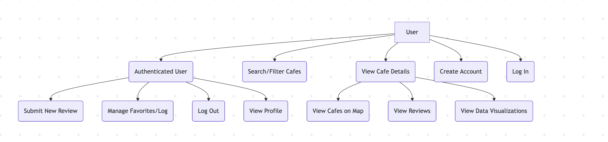
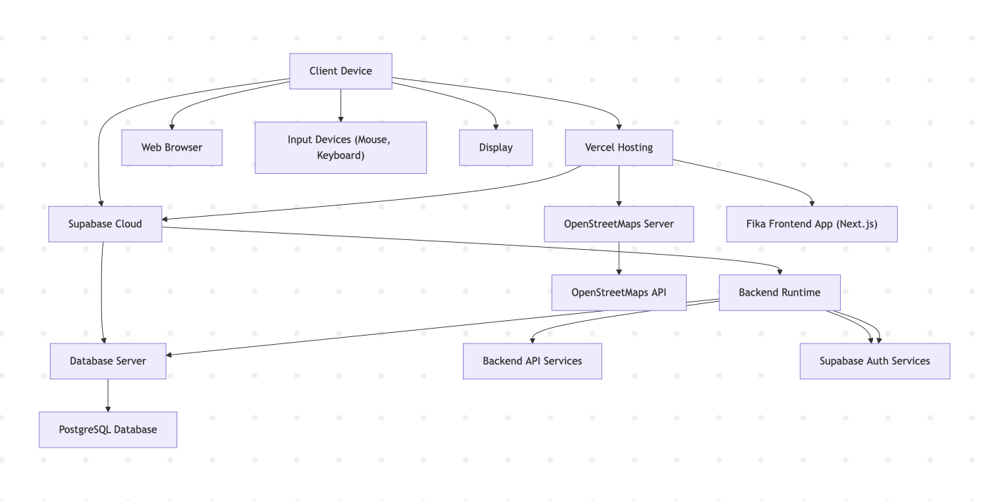
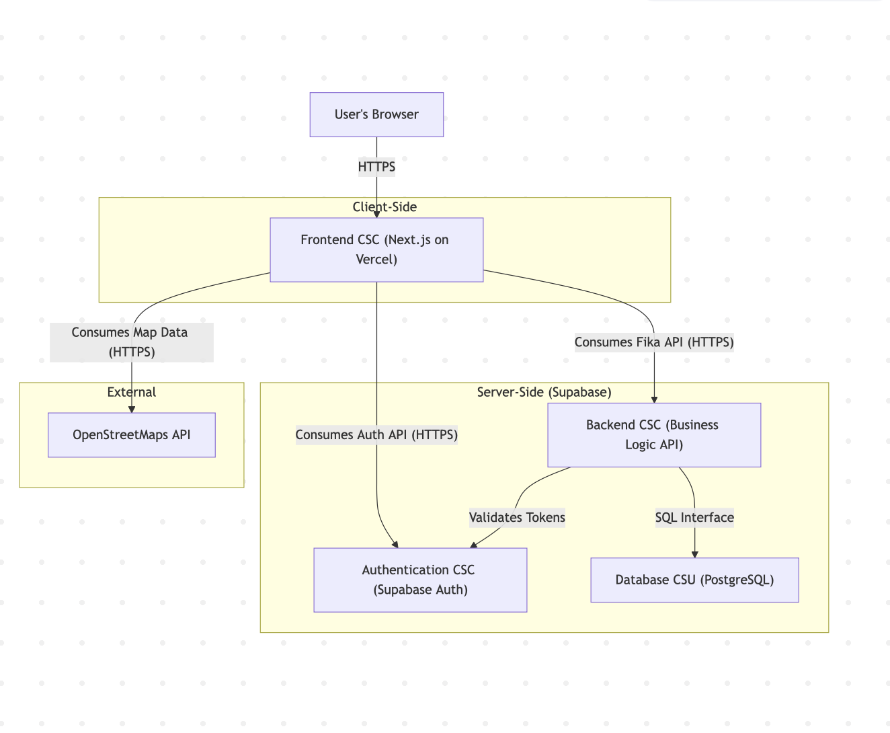
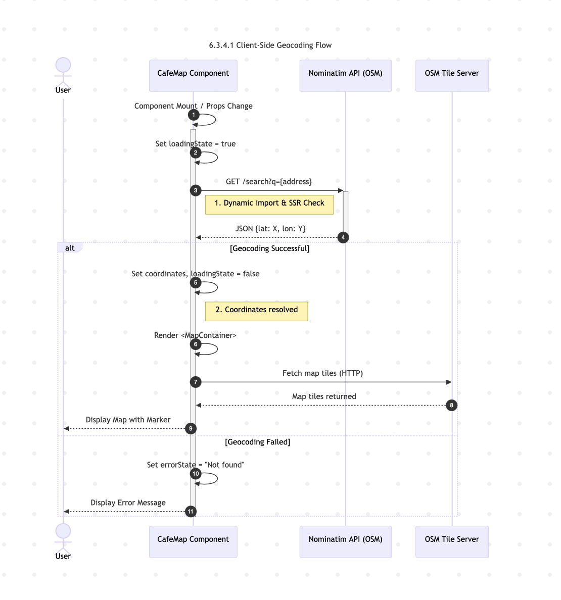
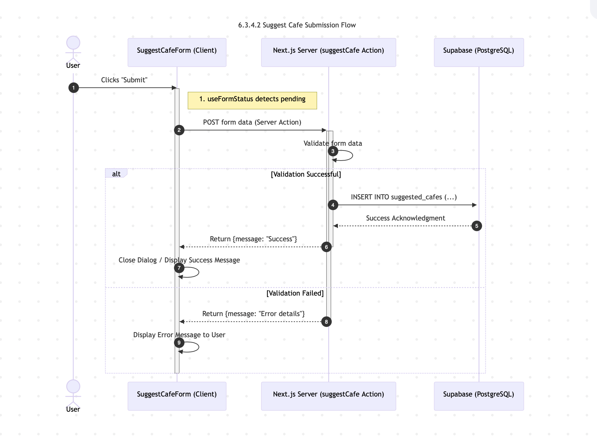
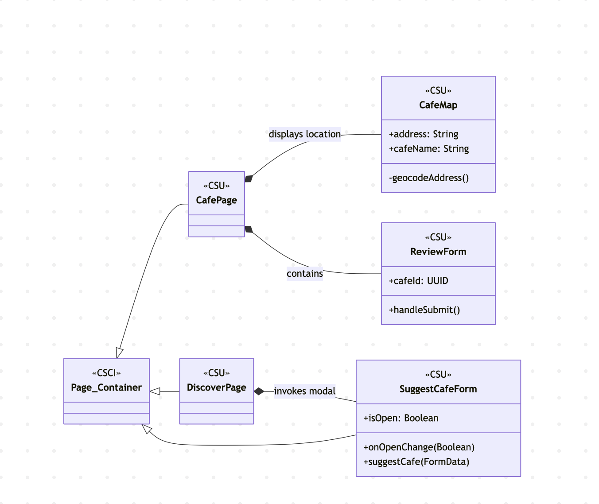
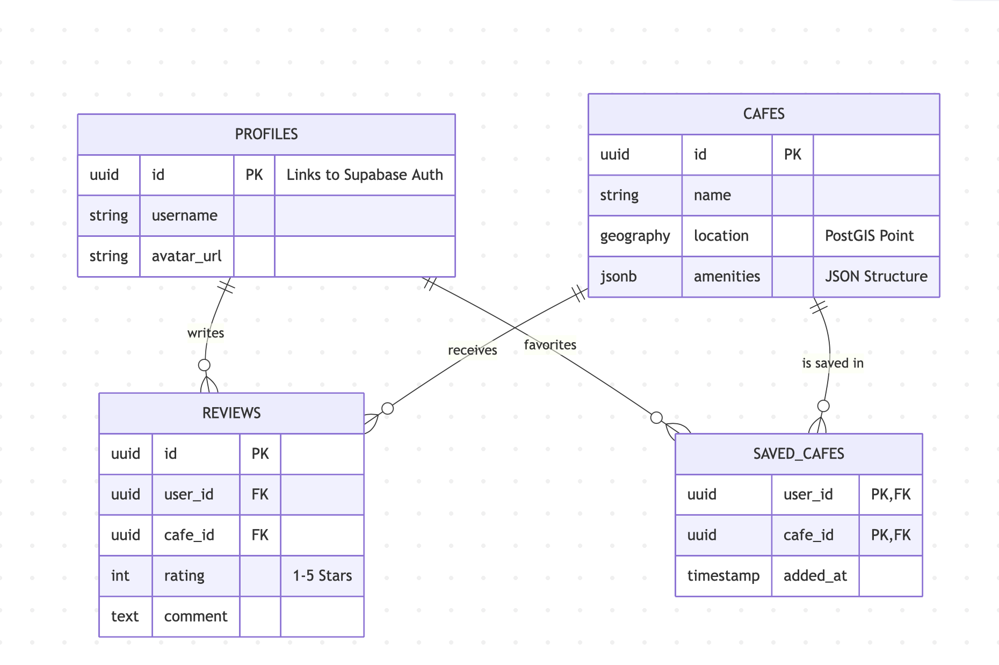

## 6.1 Introduction         
This document presents the architecture and detailed design for the fika web application. The project is a dedicated platform for discovering, reviewing, and logging visits to coffee shops based on specific criteria like parking, seating, and amenity availability. The application condenses scattered coffee shop information from various platforms (e.g., Google Reviews, TikTok) into a single, specialized tool.      

### 6.1.1 System Objectives              
The primary objective of the fika application is to provide a single, specialized web-based tool for coffee shop enthusiasts to discover, review, and log their visits, focusing on details often missing from general review platforms.        

The key goals and objectives are:       
* **Discovery and Filtering:** To provide a simple interface for searching and filtering cafes based on criteria pertinent to coffee shop goers, such as parking availability, seating capacity, Wi-Fi, and outlet availability.
* **Comprehensive Cafe Information:** To display individual cafe pages with user-provided reviews, aggregated ratings, and crucial metadata like hours, address, and amenities.
* **User Engagement:** To enable authenticated users to submit new reviews and maintain a personalized log/favorites list of the cafes they have visited.
* **Data Visualization:** To display charts visualizing trends in cafe data to help users make informed choices.
* **Performance and Scalability:** To maintain a smooth and responsive experience, ensuring search results are returned within 3 seconds, and the system can support at least 5,000 concurrent users with 99% monthly uptime.

### 6.1.2 Hardware Interfaces     
The fika application interfaces with specific hardware, software, and human elements in both its execution environment and its use of third-party APIs.      

#### 6.1.2.1 Hardware Interfaces         
* **Client Hardware**: The system relies on standard client-side hardware interfaces, including the Network (Broadband internet connection is required for access) , Display (minimum 1280x800 resolution), Mouse/Trackpad, and Keyboard for user input and navigation.
* **Deployment Hardware:** The application is hosted on cloud infrastructure. The backend/database uses a Cloud-hosted Processor (minimum 2 vCPUs) and RAM (4 GB minimum, scalable with usage). It requires Public internet access with HTTPS/TLS for network communication.     

#### 6.1.2.2 Software Interfaces      
The system integrates with several third-party software components and APIs:  

* **Next.js (latest LTS):** Used for the Frontend development framework, providing server-side rendering and a modern React development environment.
* **PostgreSQL 15+:** The primary database, managed via Supabase, stores cafe records, user accounts, and reviews. It is essential for storing cafe metadata using advanced indexing and JSONB support.
* **Supabase:** Serves as the hosting platform for the backend and managed PostgreSQL database. It is chosen for its ease of integration with PostgreSQL and real-time APIs.
* **Vercel:** Used for hosting the Next.js frontend, ensuring automatic CI/CD integration for frontend code changes.
* **Supabase Authentication:** Handles all user login, signup, and account management, securing access to logging features.
* **OpenStreetMaps API:** Used to provide geographical data on cafes and to visualize cafe locations on the Discover Page map. It is a free and open alternative to commercial mapping APIs.    

#### 6.1.2.3 Human Interfaces
* **User Interface (UI):** The system provides a web-based Graphical User Interface (GUI) accessible via a standard web browser (Chrome, Safari, etc.). The interface is divided into key areas:
  * **Discover Page:** Provides the interface to search, filter, and view cafes on an interactive map.
  * **Cafe Page:** Displays individual cafe details, reviews, and data trends.
  * **User Logging (Favorites/Reviews):** Allows users to save cafes and input new reviews.
  * **Authentication UI:** Provides dedicated login/register screens.      

## 6.2 Architectural Design      
The fika application is based on a three-tier architecture consisting of the Presentation Layer (Frontend), the Application/Business Layer (Backend API and Logic), and the Data Layer (Database). This structure ensures separation of concerns, scalability, and maintainability.        

The system is partitioned into the following four top-level Computer Software Configuration Items (CSCI):   
1. **Frontend CSC:** The user-facing web application.    
2. **Backend CSC:** The core business logic, data management, and API endpoints.
3. **Authentication CSC:** The dedicated system for user account management, managed by Supabase.
4. **Hosting & Infrastructure CSC:** The deployment and environment configuration.         
 
### 6.2.1 Major Software Components       
The major software components are derived from the CSCI breakdown:      
* **Frontend CSC (Presentation Layer):** Built with Next.js. It contains the user interface components:
  * **Discover Page CSU:** Manages cafe search, filtering, and map visualization (using OpenStreetMaps).
  * **Cafe Page CSU:** Renders individual cafe details, aggregated ratings, and trend visualizations (using Vega charts).
  * **User Logging CSU:** Manages user-specific actions like saving favorite cafes and providing an interface for writing new reviews.
    
* **Backend CSC (Application/Data Layer):** Hosted on Supabase and powered by PostgreSQL
  * **Database CSU:** Manages the database schema for storing CafeTable (details, attributes), Review Table (user reviews, ratings), and UserTable (authentication-linked user data).

* **Authentication CSC:** A dedicated Supabase-based system for user login, signup, and account management
  * **Auth CSU:** Manages the core login, logout, and secure session management.
  * **AuthUI module:** Provides the user interface for login and registration screens.
  
* **Hosting & Infrastructure CSC:**
  * **Hosting CSU:** Manages the CI/CD pipelines and deployment of the application components. This includes VercelDeploy (frontend) and SupabaseDeploy (backend services).

### Component Summary Table     

| CSCI | Responsibilities | Dependencies | Related Requirements |   
|------|------------------|--------------|----------------------|
| **Frontend CSC** | Renders UI, handles user interactions, performs search and filter operations, displays cafe details and charts | Next.js, Supabase Auth, Backend API, OpenStreetMaps | Functional: search, filtering, reviews; Performance: ≤3s search time |   
| **Backend CSC** | Implements business logic, validates requests, aggregates data, exposes API endpoints | Supabase/PostgreSQL, Supabase Auth | Performance: handle 5,000+ concurrent users; Security: token validation |  
| **Authentication CSC** | Manages user identity, secure login/signup, token/session management | Supabase Auth | Authentication requirements; Access control for review submission |   
| **Hosting & Infrastructure CSC** | Manages deployments, CI/CD, environment configuration, uptime | Vercel, Supabase | Availability: 99% uptime; Reliable deployment requirements |   

### 6.2.2 Major Software Interactions
Communication in the fika architecture is primarily through a client-server model over HTTPS/TLS.     

**Frontend CSC (Presentation Layer) – *Next.js***
  * **Discover Page CSU:** Handles searching, filtering, and map visualization with OpenStreetMaps.
  * **Cafe Page CSU:** Displays cafe details, aggregated ratings, and Vega/Vega-Lite visualizations.
  * **User Logging CSU:** Lets users save favorites and submit reviews.    

* **Scalability considerations:**
  * Static rendering for frequently accessed pages.
  * Client-side caching to reduce repeated API calls.

**Backend CSC (Application/Data Layer) – *Supabase / PostgreSQL***
* **Database CSU:** Manages CafeTable, ReviewTable, UserTable using indexing and JSONB attributes.

* **Scalability considerations:**
  * Indexed search queries.
  * Connection pooling for high concurrency.
  * Caching options for repeated metadata and map queries.

**Authentication CSC – *Supabase Auth***
 * **Auth CSU:** Issues and verifies secure tokens.
 * **Auth UI Module:** Supports login and signup interfaces.

**Hosting & Infrastructure CSC**
 * **Hosting CSU (VercelDeploy / SupabaseDeploy):** CI/CD pipelines, deployment automation, and configuration management.

### 6.2.3  Architectural Design Diagrams Section

UML Use Case Diagram:      

Deployment Diagram:      

Component Diagram: 

## 6.3 Detailed CSC and CSU Descriptions Section        
This section details the Computer Software Components and Computer Software Units that comprise the fika application. The system is divided into logical components based on the three-tier architecture (Frontend, Backend, Database).      

* **Frontend CSC**: React components and Next.js pages.
*  **Backend CSC**: Service modules that interact with Supabase.
*  **Data CSC**: Database schemas and structured data models.

### 6.3.1 Class Descriptions      
The following sections provide the details of key classes (React components and Service modules) used in the fika application. These classes are selected to represent the core functionality of the discovery and logging systems.

#### 6.3.1.1 Detailed Class Description: CafeMap 
The CafeMap class is responsible for rendering a static location map for a specific cafe within the Cafe Details Page. Due to the Next.js server-side rendering environment, this component utilizes dynamic imports to load the Leaflet library only on the client side.    

* Purpose: Convert a text-based address into geographic coordinates using the Nominatim API and render a Leaflet map showing a pinned marker.

**Fields (Props & State)**

| Field | Type | Visibility | Description |
|-------|--------|-------------|-------------|
| `address` | string | public | Physical address of the cafe |
| `cafeName` | string | public | Cafe name for marker popup |
| `coordinates` | `{ lat: number, lon: number }` | private | Derived geocoded coordinates |
| `loading` | boolean | private | True while geocoding request is active |
| `isClient` | boolean | private | Ensures Leaflet loads only on client-side |

**Methods**

| Method | Return Type | Visibility | Description |
|--------|--------------|-------------|-------------|
| `useEffect(setupMarkerIcon)` | void | private | Fixes Leaflet icon URL overrides for production |
| `geocodeAddress()` | `Promise<void>` | private | Calls Nominatim to convert address → coordinates |
| *MapContainer render* | JSX | public | Renders the map, TileLayer, and Marker |

**Error Handling**  
If geocoding fails, the component logs the error and returns a fallback “Location unavailable” state.

#### 6.3.1.2 Detailed Class Description: CafeService       
The CafeService is a utility class residing in the application layer. It acts as the abstraction layer between the Frontend UI and the Supabase client, handling data fetching and filtering logic.        

* Purpose: To construct and execute database queries against the Supabase PostgreSQL instance, ensuring that raw database logic is decoupled from the UI components.     

**Fields**

| Field | Type | Visibility | Description |
|-------|--------|-------------|-------------|
| `supabaseClient` | SupabaseClient | private | Authenticated client used for all queries |

**Methods**

| Method | Parameters | Return Type | Visibility | Description |
|--------|-------------|--------------|-------------|-------------|
| `fetchAllCafes()` | none | `Promise<Cafe[]>` | public | Retrieves all cafes |
| `fetchCafeById(id)` | `id: string` | `Promise<Cafe>` | public | Fetches a single cafe by UUID |
| `searchCafes(filters)` | `filters: FilterObject` | `Promise<Cafe[]>` | public | Dynamic SQL query using JSONB filters |
| `getAggregateRating(cafeId)` | `cafeId: string` | `Promise<number>` | public | Computes average rating |

**Error Handling**  
Returns structured error objects from Supabase and surfaces user-friendly error states.
 
#### 6.3.1.3 Detailed Class Description: SuggestCafeForm        
The SuggestCafeForm class manages the interface for users to propose new cafes for the platform. It utilizes a modal dialog and integrates with Server Actions to handle data submission.    

* Purpose: To collect structured data about a potential new cafe, including categorical attributes and boolean features, and submit this to the backend.

**Fields**

| Field | Type | Visibility | Description |
|-------|--------|-------------|-------------|
| `isOpen` | boolean | public | Controls modal visibility |
| `state` | object | private | Current server action result message |
| `pending` | boolean | private | True while submission is in progress |

**Methods**

| Method | Return Type | Visibility | Description |
|--------|--------------|-------------|-------------|
| *SuggestCafeForm render* | JSX | public | Renders input fields and dropdowns |
| `formAction` | bound server action | public | Submits form data to backend |
| `SubmitButton` | JSX | public | Shows active “Submitting…” state |

**Error Handling**  
Displays server-returned validation errors (ex: missing fields, invalid types).

### 6.3.2 Detailed Interface Descriptions
This section details the internal and external interfaces used by the system.

#### 6.3.2.1 External API Interfaces
* OpenStreetMaps (Nominatim):
  * Endpoint: GET https://nominatim.openstreetmap.org/search
  * Request Format: ?q={address}&format=json&limit=1
  * Response Format: JSON array containing lat and lon strings.
  * Error Handling: The system implements a 3-second timeout. If the API does not respond, the map defaults to a static placeholder image.
* Supabase Auth API:
  * Method: OAuth 2.0 / JWT
  * Flow: The client sends credentials; Supabase returns a sb-access-token (JWT) and a refresh-token.
  * Session Management: The sb-access-token is attached to the Authorization header (Bearer <token>) for all subsequent RLS-protected database requests.

#### 6.3.2.2 Internal Client-Server Interface
* Cafe Data Retrieval:
  * Interface: Supabase JS Client (@supabase/supabase-js)
  * Protocol: HTTPS/Secure WebSocket (for real-time subscriptions)
  * Data Format: Strictly typed JSON objects matching the Database Schema (Section 6.4).

### 6.3.3 Detailed Data Structure Descriptions        
This section details specific data structures used for storage and complex processing within the CSUs.       

* GeoJSON Feature Collection: Used by the MapView module.
  * Structure:  { "type": "Feature", "geometry": { "type": "Point", "coordinates": [lon, lat] }, "properties": { "name": "Cafe Name" } }

* JSONB Amenities Blob: Stored in PostgreSQL cafes table.
  * Structure: {"wifi": true, "seating": "large", "outlets": false}
  * Constraint: Boolean values must not be null.

* Review Object: Passed between Frontend and Backend.
  * Structure: { "id": UUID, "cafe_id": UUID, "user_id": UUID, "rating": Integer (1-5), "comment": String, "created_at": Timestamp }
  * Validation: Rating must be an integer between 1 and 5. Comment is sanitized to prevent XSS attacks.

### 6.3.4 Detailed Design Diagrams      
This section provides visual representations of the dynamic behavior and static structure of the fika system. These diagrams bridge the gap between the code specifications and the architectural overview.      

#### 6.3.4.1 Sequence Diagram: Client-Side Geocoding (CafeMap)      
This diagram details the flow of control when the CafeMap component loads the location based on the provided address.      

#### 6.3.4.2 Sequence Diagram: Suggest Cafe Submission (Server Actions)     
This diagram visualizes the communication flow for the SuggestCafeForm, utilizing the Next.js Server Action pattern (suggestCafe).       

#### 6.3.4.3 Class Diagram: Frontend Component Structure
This diagram shows the structural relationships (composition) between the key frontend units (CSUs). Member visibility is Public (+).       

## 6.4 Database Design and Description     
The fika application utilizes a relational database implemented in PostgreSQL, hosted and managed via Supabase. The database is designed to ensure data integrity between Users, Cafes, and Reviews while allowing for flexible querying of cafe amenities.      

### 6.4.1 Database Design ER Diagram      
The Entity-Relationship diagram for the *fika* database models four core entities:  
* **profiles** — user accounts authenticated via Supabase Auth
* **cafes** — physical cafe locations with metadata and amenity details
* **reviews** — user-generated feedback associated with cafes  
* **saved_cafes** — join table representing user favorites

### 6.4.2 Database Access      
#### **profiles**
| Field       | Type        | Constraints                              |
|-------------|-------------|-------------------------------------------|
| id          | UUID        | PK, references `auth.users.id`            |
| username    | text        | UNIQUE                                    |
| created_at  | timestamptz | DEFAULT now()                             |

#### **cafes**
| Field       | Type              | Constraints                                        |
|-------------|-------------------|-----------------------------------------------------|
| id          | bigint            | PK, generated always as identity                    |
| name        | text              | NOT NULL                                            |
| latitude    | double precision  | NOT NULL                                            |
| longitude   | double precision  | NOT NULL                                            |
| amenities   | JSONB             | Flexible storage for wifi, outlets, seating, etc.  |
| created_at  | timestamptz       | DEFAULT now()                                       |

**Indexes**
- GIN index on `amenities`  
- GiST or SP-GiST index on (`latitude`, `longitude`)  

#### **reviews**
| Field       | Type        | Constraints                                      |
|-------------|-------------|--------------------------------------------------|
| id          | bigint      | PK, identity                                     |
| cafe_id     | bigint      | FK → cafes(id) ON DELETE CASCADE                 |
| user_id     | UUID        | FK → profiles(id)                                |
| rating      | integer     | CHECK (rating BETWEEN 1 AND 5)                   |
| comment     | text        |                                                  |
| created_at  | timestamptz | DEFAULT now()                                    |

#### **saved_cafes**
| Field       | Type        | Constraints                                  |
|-------------|-------------|-----------------------------------------------|
| user_id     | UUID        | FK → profiles(id)                             |
| cafe_id     | bigint      | FK → cafes(id)                                |
| created_at  | timestamptz | DEFAULT now()                                 |

**Composite Key**: `(user_id, cafe_id)`  
  
### 6.4.3 Normalization and Data Integrity
The database follows **Third Normal Form (3NF)**:
* Repeated data (e.g., cafe names, locations) is stored only once.
* Reviews and favorites reference users and cafes through foreign keys.
* JSONB amenities are intentionally denormalized to support flexible feature expansion without schema migrations.

**Referential Integrity**
* Enforced through foreign keys with cascading deletes (e.g., removing a cafe deletes its reviews).
* Check constraints ensure valid rating ranges.
* Composite keys enforce uniqueness where appropriate.

### 6.4.4 Performance and Indexing Strategy
To meet the performance requirement of returning search results within **<3 seconds**, the following strategies are implemented:

* **Geospatial Indexing:** A GiST/SP-GiST index accelerates location-based searches.
* **JSONB Indexing:** A GIN index supports fast filtering on amenity keys.
* **Query Optimization:**
  * elective projection (selecting only needed fields).
  * Avoiding N+1 queries by using nested selects when needed.
  * Caching public cafe listings on the client for repeated access.  

### 6.4.5 Traceability to Requirements
Each database entity maps to functional requirements:

| Requirement | Database Entity / Mechanism |
|------------|-----------------------------|
| Users must create accounts | `profiles` + Supabase Auth |
| Users can save favorite cafes | `saved_cafes` join table |
| Users can write/edit/delete reviews | `reviews` with RLS user ownership rules |
| System must allow amenity filtering | `cafes.amenities` JSONB + GIN index |
| System must support location-based search | `cafes.latitude/longitude` + geospatial index |

### 6.4.6 Database Access
The application interacts with PostgreSQL using the Supabase Client library, which communicates via the PostGREST API.

* **Connection:** A singleton SupabaseClient instance uses environment-scoped keys:
  * Public Anon Key: for read-only operations
  * Service Role Key: for limited server-side administrative tasks  
* **Query Construction:** Queries are built through chained client methods (e.g., `.from('cafes').select('*').eq('wifi', true)`), which automatically sanitize inputs and prevent SQL injection.  
* **Latency Management:** Combined indexing strategies ensure low lookup times when filtering by location or amenities.

### 6.4.7 Database Security
Database access is secured using PostgreSQL Row Level Security (RLS) policies:

* **Public Read Access:** `cafes` and `reviews` allow global read access for browsing.  
* **Authenticated Mutations:**  
  * Users may only modify rows where `auth.uid() = user_id`.  
  * Reviews and saved_cafes enforce strict user ownership.  
* **Environment Variables:** Connection keys remain stored only in `.env.local` and never committed to version control.
